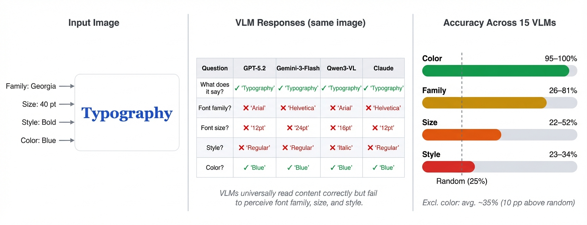
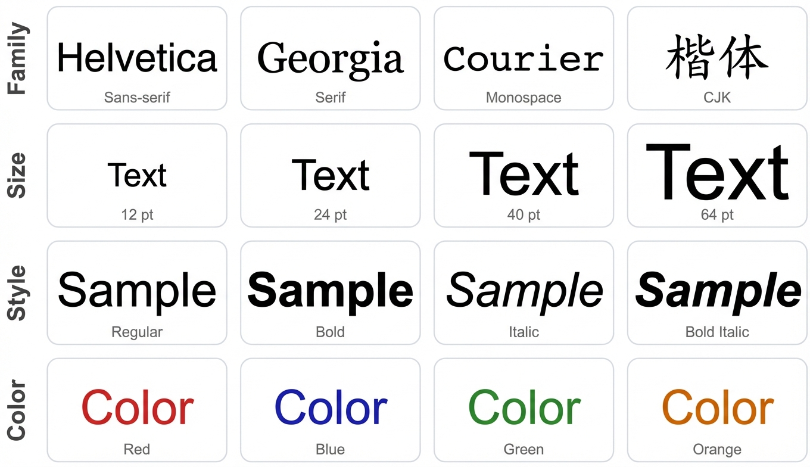
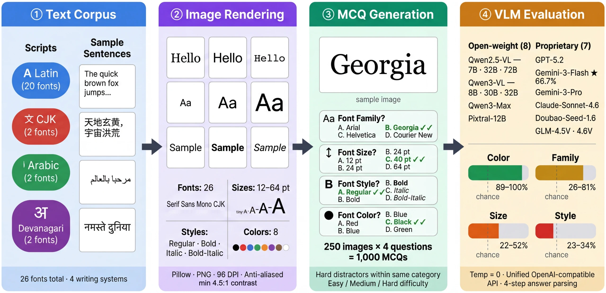
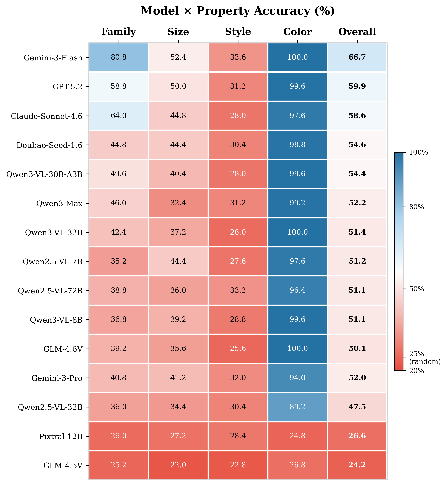
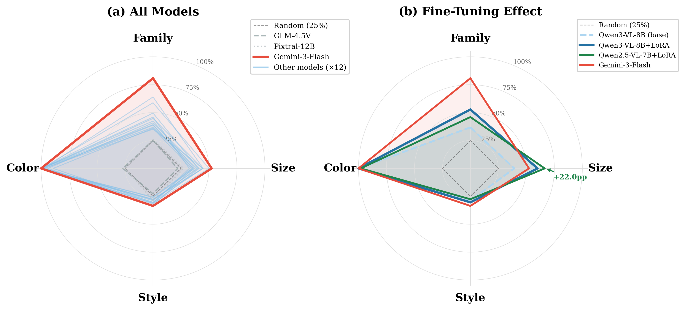
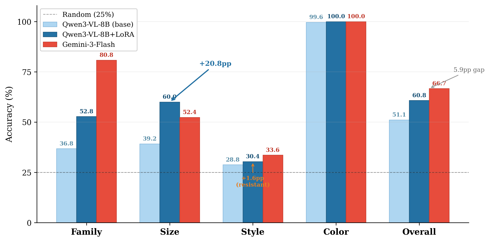
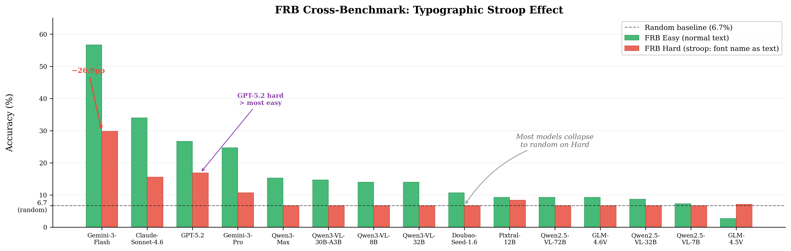

# FontBlind

> Are Vision Language Models truly "seeing" fonts, or are they font-blind?

<p align="center">
  
</p>

<p align="center"><em>VLMs universally read text correctly but fail to perceive font family, size, and style — only color is reliably recognized.</em></p>

A comprehensive multilingual font recognition benchmark that reveals VLMs' surprising blindness to typographic properties. FontBlind evaluates four fundamental properties — **font family**, **font size**, **font style**, and **font color** — across four writing systems (Latin, Chinese, Arabic, Devanagari), providing fine-grained diagnosis of where and why VLMs succeed or fail at font perception.

## Key Features

- **Multi-property evaluation**: 4 font properties (family, size, style, color) with 1,000 multiple-choice questions
- **Multilingual**: 26 fonts across Latin (20), CJK (2), Arabic (2), and Devanagari (2)
- **Difficulty stratification**: Easy / Medium / Hard levels based on visual discriminability
- **Robustness testing**: Gaussian noise, blur, JPEG compression, rotation transforms
- **Resolution ablation**: 0.25x to 2.0x scaling analysis
- **Cross-benchmark (FRB)**: Replication of the Font Recognition Benchmark for comparison
- **CV baseline**: Traditional computer vision heuristic baseline
- **Fine-tuning**: LoRA fine-tuning data generation pipeline for Qwen VL models

<p align="center">
  
</p>

<p align="center"><em>FontBlind evaluates four typographic properties across multiple scripts.</em></p>

## Benchmark Pipeline

<p align="center">
  
</p>

## Project Structure

```
FontBlind/
├── fontbench/                     # Core package
│   ├── config.py                  # API, model, and path configuration
│   ├── fonts.py                   # Font registry (26 fonts, 4 scripts)
│   ├── generator.py               # Synthetic image renderer (PIL)
│   ├── questions.py               # MC question & distractor generation
│   ├── build_benchmark.py         # Dataset builder
│   ├── evaluator.py               # VLM evaluation via OpenAI-compatible API
│   ├── scoring.py                 # Accuracy computation & breakdowns
│   ├── transforms.py              # Robustness transforms & resolution scaling
│   ├── cv_baseline.py             # Traditional CV heuristic baseline
│   ├── prompting.py               # Prompt templates
│   ├── run_eval.py                # Main evaluation entry point
│   ├── frb_eval.py                # FRB cross-benchmark evaluation
│   ├── visualize.py               # Plot generation
│   ├── experiments/               # Experiment runners and one-off utilities
│   │   ├── run_robustness.py
│   │   ├── run_resolution_fast.py
│   │   └── run_frb_single.py
│   ├── attention/                 # Attention map extraction & visualization
│   ├── data/
│   │   ├── synthetic/             # 250 benchmark samples + metadata
│   │   └── frb/                   # 375 FRB cross-benchmark samples
│   ├── results/                   # Pre-computed evaluation outputs (JSON + CSV)
│   │   └── finetuned/             # Fine-tuned model results
│   └── finetuning/                # LoRA fine-tuning pipeline
│       ├── generate_train_data.py # Training data generation
│       ├── train_lora.py          # LoRA training script
│       ├── eval_finetuned.py      # Evaluate fine-tuned models
│       └── serve_lora.py          # Serve LoRA adapter via vLLM
├── site/                          # Project website source (HTML/CSS/JS)
├── site-dist/                     # Generated GitHub Pages artifact
├── scripts/                       # Build and sync helpers
├── tests/                         # Unit & integration tests
└── requirements.txt
```

## Quick Start

### Installation

```bash
git clone https://github.com/your-username/FontBlind.git
cd FontBlind
pip install -r requirements.txt
```

### Configuration

Set your API endpoint and key via environment variables:

```bash
export OPENAI_API_BASE="https://api.openai.com/v1/"
export OPENAI_API_KEY="your-api-key"
```

FontBlind uses the OpenAI-compatible API format. You can point it to any compatible endpoint (OpenAI, vLLM, Ollama, etc.).

### Generate Benchmark Dataset

The benchmark data (250 samples) is included in `fontbench/data/synthetic/`. To regenerate:

```bash
python -m fontbench.build_benchmark
```

### Run Evaluation

```bash
# All configured models, MC format
python -m fontbench.run_eval --task mc

# Specific models
python -m fontbench.run_eval --task mc --models Qwen3-VL-8B Gemini-3-Flash

# Include CV baseline
python -m fontbench.run_eval --task mc --include-cv-baseline
```

Results are saved to `fontbench/results/`.

### Robustness & Resolution Experiments

```bash
# Robustness (noise, blur, JPEG, rotation)
python -m fontbench.experiments.run_robustness --models Qwen3-VL-8B

# Resolution ablation (0.25x, 0.5x, 1.0x, 2.0x)
python -m fontbench.experiments.run_resolution_fast --models Qwen3-VL-8B Gemini-3-Flash GPT-5.2
```

### FRB Cross-Benchmark

```bash
python -m fontbench.frb_eval
```

### Generate Plots & Leaderboard

```bash
python -m fontbench.visualize
```

### Generate Fine-Tuning Data

```bash
python -m fontbench.finetuning.generate_train_data
```

## Results

### Model x Property Accuracy

<p align="center">
  
</p>

### Radar Chart: Model Profiles & Fine-Tuning Effect

<p align="center">
  
</p>

### Leaderboard (15 Models)

| Model | Type | Family | Size | Style | Color | Overall |
|-------|------|:---:|:---:|:---:|:---:|:---:|
| Gemini-3-Flash | Commercial | **80.8** | 52.4 | 33.6 | **100.0** | **66.7%** |
| GPT-5.2 | Commercial | 58.8 | **50.0** | 31.2 | 99.6 | 59.9% |
| Claude-Sonnet-4.6 | Commercial | 64.0 | 44.8 | 28.0 | 97.6 | 58.6% |
| Doubao-Seed-1.6 | Commercial | 44.8 | 44.4 | 30.4 | 98.8 | 54.6% |
| Qwen3-VL-30B-A3B | Open | 49.6 | 40.4 | 28.0 | 99.6 | 54.4% |
| Qwen3-Max | Commercial | 46.0 | 32.4 | 31.2 | 99.2 | 52.2% |
| Gemini-3-Pro | Commercial | 40.8 | 41.2 | 32.0 | 94.0 | 52.0% |
| Qwen3-VL-32B | Open | 42.4 | 37.2 | 26.0 | **100.0** | 51.4% |
| Qwen2.5-VL-7B | Open | 35.2 | 44.4 | 27.6 | 97.6 | 51.2% |
| Qwen2.5-VL-72B | Open | 38.8 | 36.0 | 33.2 | 96.4 | 51.1% |
| Qwen3-VL-8B | Open | 36.8 | 39.2 | 28.8 | 99.6 | 51.1% |
| GLM-4.6V | Open | 39.2 | 35.6 | 25.6 | **100.0** | 50.1% |
| Qwen2.5-VL-32B | Open | 36.0 | 34.4 | 30.4 | 89.2 | 47.5% |
| Pixtral-12B | Open | 26.0 | 27.2 | 28.4 | 24.8 | 26.6% |
| GLM-4.5V | Open | 25.2 | 22.0 | 22.8 | 26.8 | 24.2% |

### Fine-Tuning: Closing the Gap with LoRA

<p align="center">
  
</p>

<p align="center"><em>LoRA fine-tuning on 3,000 synthetic samples lifts Qwen3-VL-8B from 51.1% to 60.8%, narrowing the gap to Gemini-3-Flash (66.7%) to just 5.9pp. Font size gains are the most dramatic (+20.8pp).</em></p>

### FRB Cross-Benchmark: Typographic Stroop Effect

<p align="center">
  
</p>

### Key Findings

1. **Color is solved; style is not.** Most VLMs achieve 94-100% on color but only 26-34% on style (near random).
2. **Gemini-3-Flash dominates font family** (80.8%), followed by Claude-Sonnet-4.6 (64.0%) and GPT-5.2 (58.8%).
3. **Model scale ≠ font perception.** Qwen2.5-VL-72B (51.1%) barely outperforms Qwen2.5-VL-7B (51.2%), and Qwen2.5-VL-32B (47.5%) underperforms both.
4. **Robustness varies by property.** Color is resilient; family degrades sharply under noise/blur.
5. **Resolution matters for size.** Downscaling to 0.25x drops size accuracy by ~15 pp but barely affects color.
6. **Stroop effect confirmed.** On FRB's hard set (font name as text content), most models fall to random baseline.
7. **GLM-4.5V and Pixtral-12B are effectively font-blind** — performing at or near random baseline (25%) across all properties.

## Adding Custom Models

Edit the `MODELS` list in `fontbench/config.py` to add your own models:

```python
MODELS = [
    {"id": "your-model-id", "name": "Your-Model", "type": "open-source", "size": "small"},
    # ...
]
```

The `id` field should match the model identifier expected by your API endpoint.

## Tests

```bash
pytest tests/
```

## Citation

If you use FontBlind in your research, please cite:

```bibtex
@misc{zhou2026readingneqseeingdiagnosing,
  title={Reading $\neq$ Seeing: Diagnosing and Closing the Typography Gap in Vision-Language Models},
  author={Heng Zhou and Ao Yu and Li Kang and Yuchen Fan and Yutao Fan and Xiufeng Song and Hejia Geng and Yiran Qin},
  year={2026},
  eprint={2603.08497},
  archivePrefix={arXiv},
  primaryClass={cs.CV},
  url={https://arxiv.org/abs/2603.08497},
}
```

## License

This project is licensed under the MIT License - see the [LICENSE](LICENSE) file for details.
